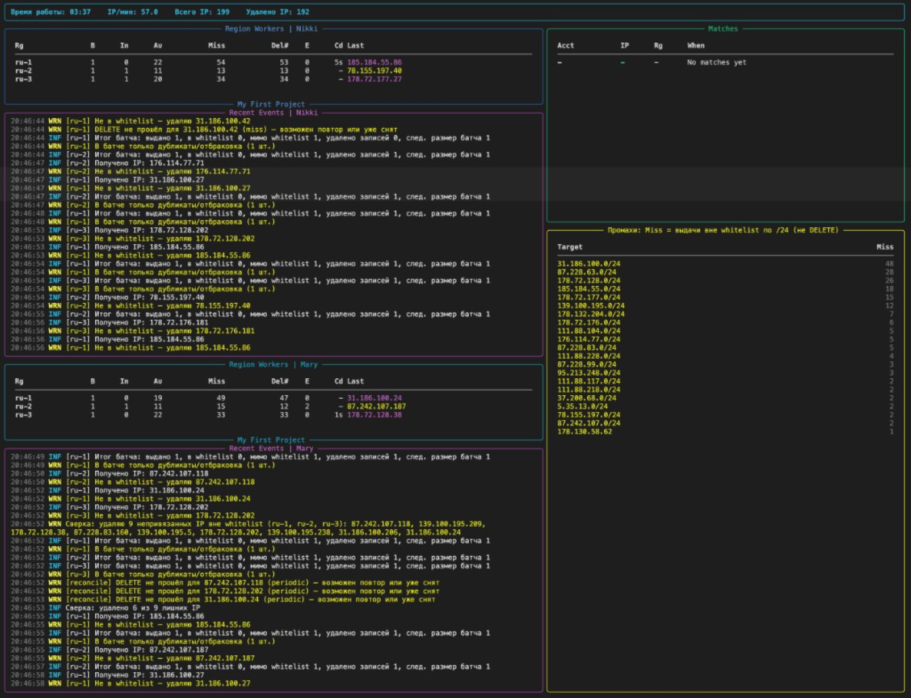

# Selectel IP Roller

Автоматический перебор floating IP на Selectel. Программа запрашивает IP-адреса в указанных регионах, сверяет их с `whitelist.txt` и оставляет только адреса из нужных сетей. Остальные удаляет. Поддерживает одновременную работу с двумя аккаунтами.



---

## Содержание

1. [Что нужно перед запуском](#1-что-нужно-перед-запуском)
2. [Быстрый старт](#2-быстрый-старт)
3. [Настройка .env вручную](#3-настройка-env-вручную)
4. [Где взять данные в панели Selectel](#4-где-взять-данные-в-панели-selectel)
5. [Что такое whitelist.txt](#5-что-такое-whitelisttxt)
6. [Как работает программа](#6-как-работает-программа)
7. [Режимы: один или два аккаунта](#7-режимы-один-или-два-аккаунта)
8. [Дашборд и что на нём видно](#8-дашборд-и-что-на-нём-видно)
9. [Файлы результатов](#9-файлы-результатов)
10. [Полезные флаги](#10-полезные-флаги)
11. [Безопасность: что программа никогда не удалит](#11-безопасность-что-программа-никогда-не-удалит)
12. [Если что-то не работает](#12-если-что-то-не-работает)
13. [Структура проекта](#13-структура-проекта)

---

---

## 1. Что нужно перед запуском

| Требование | Минимум |
|---|---|
| Python | **3.10** и выше (скрипт попытается установить сам, см. ниже) |
| ОС | Windows 10+, macOS 12+, Linux (любой дистрибутив) |
| Интернет | нужен для обращения к Selectel API |
| Аккаунт Selectel | один (или два для параллельного перебора) |

### Автоустановка Python

`run.sh` и `run.bat` **сами попытаются установить Python**, если его нет:

| ОС | Что сделает скрипт |
|---|---|
| macOS | Установит [Homebrew](https://brew.sh) (если нет), затем `brew install python3` |
| Ubuntu / Debian | `sudo apt-get install python3 python3-venv python3-pip` |
| Fedora / RHEL | `sudo dnf install python3` |
| Arch Linux | `sudo pacman -Sy python` |
| openSUSE | `sudo zypper install python3` |
| Windows | `winget install Python.Python.3.12` (встроен в Windows 10/11) |

Если автоустановка не сработала — поставьте вручную с [python.org](https://www.python.org/downloads/) (версию 3.10 или новее). На Windows при установке **обязательно поставьте галочку «Add Python to PATH»**.

---

## 2. Быстрый старт

### Шаг 1 — Скачайте проект

```bash
git clone https://github.com/bymakk/selectel_roller.git
cd selectel_roller
```

Или скачайте ZIP с [GitHub Releases](https://github.com/bymakk/selectel_roller/releases) и распакуйте.

### Шаг 2 — Запустите

**macOS / Linux:**

```bash
chmod +x run.sh
./run.sh
```

**Windows:**

```bat
run.bat
```

**Через Python напрямую (любая ОС):**

```bash
python main.py
```

> При первом запуске скрипт делает всё сам:
> 1. **Проверяет / устанавливает Python** — если Python 3.10+ не найден, `run.sh` ставит его через Homebrew (macOS) или `apt/dnf/pacman` (Linux); `run.bat` использует `winget` (Windows 10/11).
> 2. Создаёт изолированное виртуальное окружение `.venv` и устанавливает все зависимости из `requirements.txt`.
> 3. Открывает **мастер настройки** — по шагам спрашивает логин, пароль и ID аккаунта Selectel.
> 4. Сохраняет введённые данные в файл `.env` и запускает перебор.

При повторных запусках мастер уже не показывается — данные читаются из `.env`.

---

## 3. Настройка .env вручную

Если мастер настройки недоступен (например, работаете без терминала) — создайте файл `.env` в корне проекта, скопировав из `.env.example`:

```bash
cp .env.example .env
```

Откройте `.env` и заполните:

```ini
# ── Первый аккаунт (обязательно) ─────────────────────────────────────────────
SEL_USERNAME=ваш_логин_сервисного_пользователя
SEL_PASSWORD=ваш_пароль
SEL_ACCOUNT_ID=123456

# ── Второй аккаунт (если нужен параллельный перебор) ─────────────────────────
SEL2_USERNAME=другой_логин
SEL2_PASSWORD=другой_пароль
SEL2_ACCOUNT_ID=654321
```

Остальные переменные в `.env.example` — опциональны. При первом запуске программа сама допишет `SEL_PROJECT_ID` и `SEL_PROJECT_NAME` после того, как найдёт или создаст проект.

---

## 4. Где взять данные в панели Selectel

### SEL_ACCOUNT_ID — ID аккаунта

1. Откройте [my.selectel.ru](https://my.selectel.ru).
2. В правом верхнем углу, под вашим email, будет **число** — это и есть ID аккаунта (например, `575493`).

### SEL_USERNAME и SEL_PASSWORD — логин и пароль сервисного пользователя

Сервисный пользователь — это **не ваш личный логин**, а специальный API-пользователь. Его нужно создать один раз.

**Шаг 1 — Создать пользователя:**

1. Войдите в [my.selectel.ru](https://my.selectel.ru).
2. В верхнем меню нажмите **IAM** → слева выберите **Сервисные пользователи**.
3. Нажмите кнопку **Создать пользователя** (правый верхний угол).
4. Введите любое имя, например `roller` или `ip-roller-bot`.
5. Нажмите **Создать**.
6. В появившемся окне будет показан пароль — **скопируйте его сразу**, потом увидеть невозможно.

> Если пароль потерян — откройте пользователя → нажмите **Сгенерировать новый пароль**.

**Шаг 2 — Выдать права (роли):**

Программе нужны следующие разрешения в облаке Selectel:

| Что программа делает | Какая роль нужна |
|---|---|
| Создать / удалить проект (`/vpc/resell/v2/projects`) | **Администратор аккаунта** или **Billing administrator** — на уровне аккаунта |
| Запросить / удалить floating IP (Neutron) | **Администратор проекта** или **Operator** — на уровне проекта `ip-roller` |
| Посмотреть список VM (Nova) | **Наблюдатель** (Observer) — минимум; лучше **Оператор** |
| Посмотреть / удалить volumes (Cinder) | **Администратор проекта** или **Operator** |

**Как назначить роли:**

1. В разделе **IAM → Сервисные пользователи** нажмите на имя созданного пользователя.
2. Перейдите на вкладку **Роли**.
3. Нажмите **Добавить роль**.
4. Тип: **Аккаунт** → роль: **Администратор аккаунта** → сохранить.

> **Почему роль на уровне аккаунта?** Программа обращается к VPC Resell API (`api.selectel.ru/vpc/resell/v2/projects`) для поиска и создания проекта `ip-roller`. Этот API требует токена, скоупированного на аккаунт (domain scope), а не на конкретный проект. Без этой роли Selectel вернёт `403 Forbidden`.

> **Минимальная конфигурация** (если не хотите давать права администратора аккаунта): создайте проект `ip-roller` вручную в панели Selectel, запишите его ID в `.env` как `SEL_PROJECT_ID=...` и укажите `--no-auto-create-project`. Тогда роль **Оператор** на уровне проекта будет достаточна.

### SEL_PROJECT_NAME / SEL_PROJECT_ID — проект (опционально)

Заполнять не обязательно. Программа сама:
- найдёт или создаст проект с именем `ip-roller`;
- запишет его ID в `.env` — при следующих запусках авторизация будет быстрее.

Если хотите работать в другом проекте — укажите его название в `SEL_PROJECT_NAME`.

Найти ID проекта: панель Selectel → **Облако** → **Проекты** → нажать на нужный проект → скопировать ID из URL или карточки.

---

## 5. Что такое whitelist.txt

Файл `whitelist.txt` — это список IP-адресов и подсетей, которые программа считает **подходящими**. Адреса из этого файла никогда не удаляются.

Формат файла: одна запись на строку. Поддерживаются:

```
# Комментарии начинаются с #
5.35.0.0/16         # подсеть CIDR
194.87.0.0/18       # другая подсеть
1.2.3.4             # одиночный IP (редко нужен)
```

**Логика работы:**

- Программа получает floating IP.
- Если IP **попадает** в одну из записей whitelist → сохраняется как «совпадение» (Match).
- Если IP **не попадает** → удаляется, запрашивается следующий.

Редактируйте `whitelist.txt` в любом текстовом редакторе. Изменения вступают в силу **при следующем запуске** (или сразу, если включён reconciler).

---

## 6. Как работает программа

```
Запуск
  │
  ├─► Мастер настройки (если .env пустой)
  │     └─ сохраняет логин/пароль/account_id в .env
  │
  ├─► Показывает превью whitelist.txt
  │
  ├─► Авторизация в Selectel (OpenStack Keystone v3)
  │
  ├─► Автопоиск / создание проекта «ip-roller»
  │     └─ записывает SEL_PROJECT_ID в .env
  │
  ├─► Проверка на активные VM в проекте
  │     └─ если есть → спрашивает подтверждение
  │
  ├─► Получение списка доступных регионов
  │
  └─► Основной цикл по каждому региону:
        ┌─► Запросить floating IP
        ├─► Попал в whitelist? → сохранить как Match
        │                      → при достижении цели (TARGET_COUNT) — остановиться
        └─► Не попал → удалить → повторить
```

**Стартовая чистка**: при запуске программа сначала проверяет все уже существующие floating IP в проекте. Адреса из whitelist сохраняет, остальные свободные (без привязки к VM) удаляет.

**Фоновая сверка (reconciler)**: каждые N секунд программа заново сверяет список floating IP с whitelist, удаляя появившиеся «лишние».

---

## 7. Режимы: один или два аккаунта

Программа автоматически определяет режим по наличию переменных в `.env`:

| Что задано в .env | Режим | Интерфейс |
|---|---|---|
| Только `SEL_*` | Один аккаунт | Одна колонка регионов и событий |
| Только `SEL2_*` | Один аккаунт (второй) | Одна колонка регионов и событий |
| Оба `SEL_*` и `SEL2_*` | Два аккаунта | Два воркера рядом, общие Matches/Miss |

При старте отображается баннер с режимом — сразу понятно, что запускается.

### Параллельный перебор (два аккаунта)

Оба воркера работают независимо, каждый в своём проекте `ip-roller`. Результаты Matches объединяются в общей таблице.

Задать разные регионы для каждого воркера:

```ini
SEL1_SCANNER_REGIONS=ru-1,ru-2
SEL2_SCANNER_REGIONS=ru-3
```

---

## 8. Дашборд и что на нём видно

При работе в терминале открывается live-интерфейс:

```
┌─ Время работы: 00:05:23 · IP/мин: 28.4 · Всего IP: 142 · Удалено IP: 141 ────┐

┌─ Region Workers │ Аккаунт 1 ──────────────────────────────┐  ┌─ Matches ──────┐
│ Rg   B  In  A∪  Miss  Del#  E   Cd  Last                  │  │ IP             │
│ ru-1 1   0  87    86    86  0    -  5.35.16.88 ✓ Match    │  │ 5.35.16.88     │
│ ru-2 1   0  55    54    54  0    -  194.87.0.1 ✗ Miss     │  │                │
└───────────────────────────────────────────────────────────┘  └────────────────┘

┌─ Recent Events │ Аккаунт 1 ──────────────────────────────┐  ┌─ Miss Churn ───┐
│ [18:42:01] ✓ Match: 5.35.16.88 (ru-1)                    │  │ 5.35.0.0/24    │
│ [18:42:03] ✗ Miss:  194.87.0.1 → удалён (ru-2)           │  │ 194.87.0.0/24  │
└───────────────────────────────────────────────────────────┘  └────────────────┘
```

**Колонки Region Workers:**

| Колонка | Что означает |
|---|---|
| `Rg` | Регион (ru-1, ru-2, ru-3) |
| `B` | Batch size — размер текущего батча |
| `In` | In-flight — запросов в воздухе прямо сейчас |
| `A∪` | Всего уникальных IP выдано в этом регионе за сессию |
| `Miss` | Промахи — IP не из whitelist (удалены) |
| `Del#` | Выполненных DELETE-запросов |
| `E` | Количество ошибок API |
| `Cd` | Cooldown — время ожидания после пустого ответа |
| `Last` | Последний IP или ошибка |

**Правая панель Matches** — список найденных совпадений с whitelist: адрес, регион, время.

**Miss Churn** — сводка промахов по подсетям /24 с процентами. Показывает, какие подсети чаще всего попадаются, но не входят в whitelist.

---

## 9. Файлы результатов

Все файлы создаются в папке `temp/` (в .gitignore, не попадают в репозиторий).

| Файл | Содержимое |
|---|---|
| `temp/selectel-scanner-state.json` | **Совпадения с whitelist** — найденные IP: адрес, регион, ID ресурса, время. При dual — две секции (`account-1` / `account-2`). |
| `temp/miss-churn.txt` | **Сводка промахов** по подсетям /24: подсеть и число Miss с процентами. |
| `temp/scanner.log` | **Подробный лог событий** — появляется только с флагом `--log-file temp/scanner.log`. |

Чтобы найти совпавшие IP после остановки — откройте `temp/selectel-scanner-state.json`.

---

## 10. Полезные флаги

```bash
# Показать справку
./run.sh --help

# Пропустить подтверждение активных VM (режим автоматизации)
./run.sh --yes

# Принудительно запустить мастер настройки (если хотите изменить данные)
./run.sh --setup

# Записать подробный лог в файл
./run.sh --log-file temp/scanner.log

# Вывести события в stderr параллельно с дашбордом
./run.sh --rich-logs

# Задать регионы вручную
./run.sh --regions ru-1 ru-2

# Не создавать новый проект автоматически
./run.sh --no-auto-create-project

# Задать имя проекта для автосоздания (по умолчанию «ip-roller»)
./run.sh --auto-project-name myproject

# Задать цель (сколько совпадений нужно найти)
./run.sh --target-count 3
```

---

## 11. Безопасность: что программа никогда не удалит

### Адреса из whitelist.txt

Защита реализована тремя независимыми слоями в `scanner/main.py`:

1. **Пред-фильтр** — перед формированием списка на удаление whitelist-адреса вырезаются.
2. **Перед HTTP-запросом** — прямо перед вызовом `DELETE` повторная проверка.
3. **После взятия семафора** — финальная проверка, учитывает изменения `whitelist.txt` в реальном времени.

### VM и привязанные IP

- Floating IP, привязанный к виртуальной машине (поле `port_id` / `fixed_ip_address` не пустое) — **никогда не удаляется**.
- При старте, если в проекте есть активные VM, программа показывает их список и ждёт подтверждения. Без ответа «да» работа не начинается. (Пропустить: `--yes`.)

### Чужие проекты

Программа работает **только в своём проекте** `ip-roller`. Другие проекты аккаунта не затрагиваются — она их видит, но не трогает.

---

## 12. Если что-то не работает

### «python not found» / «python3 not found»

`run.sh` и `run.bat` попытаются установить Python автоматически. Если не получилось:

- **Windows**: `winget install Python.Python.3.12` в PowerShell (от администратора), или скачайте с [python.org](https://www.python.org/downloads/) и при установке поставьте галочку **«Add Python to PATH»**. После — закройте и откройте терминал заново.
- **macOS**: `brew install python3` (Homebrew нужен; если его нет — `/bin/bash -c "$(curl -fsSL https://raw.githubusercontent.com/Homebrew/install/HEAD/install.sh)"`)
- **Ubuntu/Debian**: `sudo apt-get update && sudo apt-get install python3 python3-venv python3-pip`
- **Fedora**: `sudo dnf install python3`

### «Не удалось авторизоваться» / «401 Unauthorized»

Проверьте:
1. Правильно ли указаны `SEL_USERNAME`, `SEL_PASSWORD`, `SEL_ACCOUNT_ID` в `.env`.
2. У сервисного пользователя есть роль **Администратор аккаунта** (на уровне аккаунта) — см. [раздел 4](#4-где-взять-данные-в-панели-selectel).
3. Пароль введён без лишних пробелов. Если в пароле есть спецсимволы (`@`, `$`, `!`, `#`, пробел) — оберните значение в двойные кавычки:
   ```ini
   SEL_PASSWORD="moj_p@$$w0rd!"
   ```

### «403 Forbidden» при поиске проектов

Сервисному пользователю не хватает прав на уровне аккаунта. Нужна роль **Администратор аккаунта**:

1. Панель Selectel → **IAM → Сервисные пользователи** → ваш пользователь.
2. Вкладка **Роли** → **Добавить роль**.
3. Тип: **Аккаунт** → роль: **Администратор аккаунта** → сохранить.

Альтернатива без прав администратора: создайте проект `ip-roller` вручную, укажите `SEL_PROJECT_ID=...` в `.env` и запустите с флагом `--no-auto-create-project`.

### «Проект не найден»

Либо задан несуществующий `SEL_PROJECT_NAME`, либо аккаунт не даёт доступа к проектам. Попробуйте удалить `SEL_PROJECT_NAME` и `SEL_PROJECT_ID` из `.env` — программа найдёт или создаст проект автоматически.

### Дашборд не показывается / текст мусор

Терминал не поддерживает ANSI. Попробуйте:

```bash
./run.sh --no-rich
```

Или настройте терминал: в Windows используйте **Windows Terminal** вместо старого `cmd.exe`.

### Хочу сбросить настройки и начать заново

```bash
./run.sh --setup
```

Или просто удалите `.env` — мастер настройки запустится снова при следующем старте.

### Очистить все состояния (Matches, Miss)

```bash
rm -rf temp/
```

---

## 13. Структура проекта

```
selectel_roller/
│
├── main.py                    # Точка входа: создаёт .venv, ставит пакеты, запускает scanner
├── run.sh                     # Запуск на macOS / Linux
├── run.bat                    # Запуск на Windows
├── requirements.txt           # Python-зависимости
├── whitelist.txt              # Ваш список подходящих IP и подсетей
├── .env.example               # Шаблон конфигурации (скопируйте в .env и заполните)
│
├── docs/
│   └── images/                # Скриншоты для README
│
└── scanner/                   # Основная логика
    ├── __init__.py
    ├── dual.py                # Оркестратор: один или два воркера, Rich Live-дашборд
    ├── main.py                # Логика сканера: батчи, удаления, reconciler, дашборд
    ├── client.py              # OpenStack/Neutron/Nova/Cinder HTTP-клиент
    ├── resell.py              # Selectel VPC Resell API v2 (управление проектами)
    ├── bootstrap.py           # Автопоиск/создание проекта, проверка VM, whitelist-банер
    ├── setup_wizard.py        # Мастер первоначальной настройки (спрашивает логин/пароль)
    ├── prompts.py             # Интерактивные диалоги (questionary + rich + input fallback)
    ├── config.py              # Загрузка .env и config.json, dataclass ScannerConfig
    ├── models.py              # Dataclass FloatingIPRecord, MatchRecord, RegionRunState и др.
    ├── whitelist.py           # Загрузка и проверка whitelist.txt (WhitelistMatcher)
    ├── state.py               # Сохранение/загрузка state.json (найденные Matches)
    ├── dashboard.py           # Функции рендеринга Rich-дашборда (одиночный воркер)
    ├── rich_ui.py             # Общие Rich-константы и утилиты
    ├── strategy.py            # Стратегия ожидания и cooldown между батчами
    ├── ip_frequency.py        # Счётчик Miss Churn по подсетям /24
    └── paths.py               # Пути к .env, whitelist.txt, state.json
```

---

## Лицензия

MIT — делайте что хотите, на свой страх и риск.
